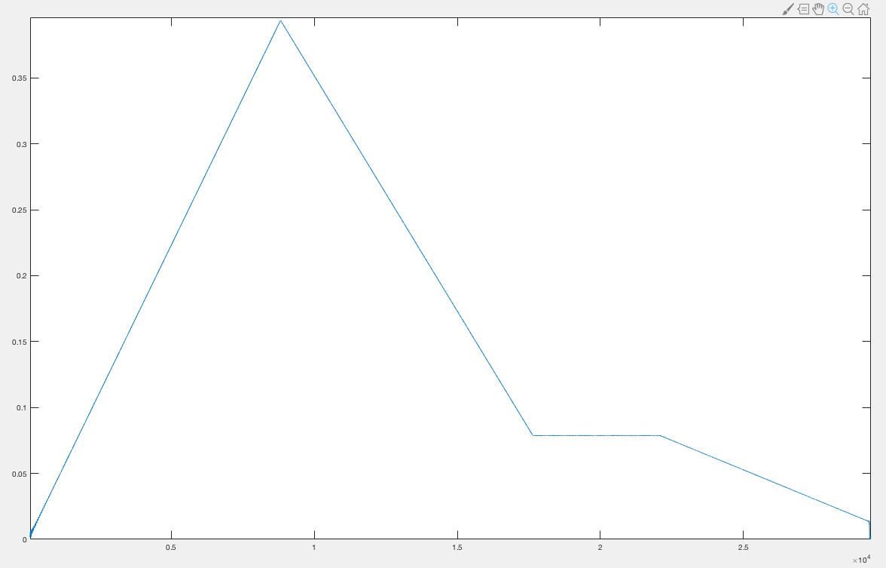
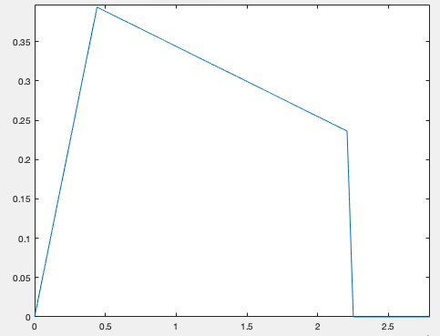
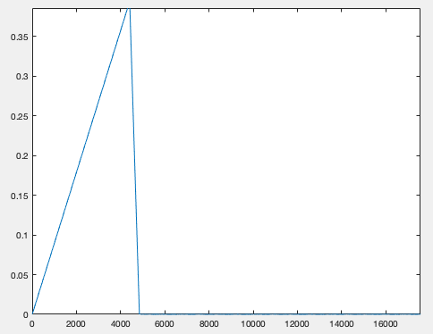
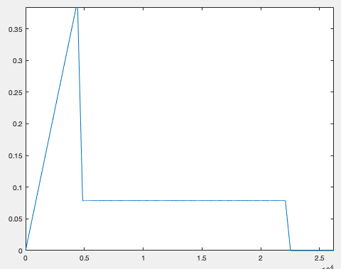
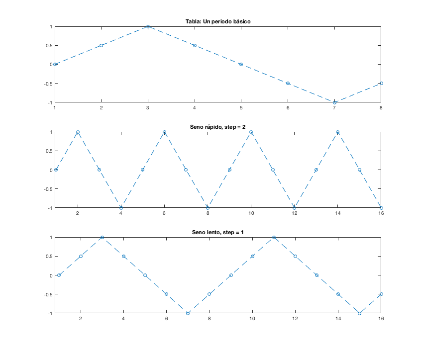
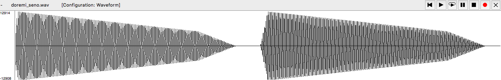
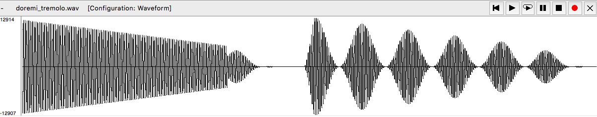
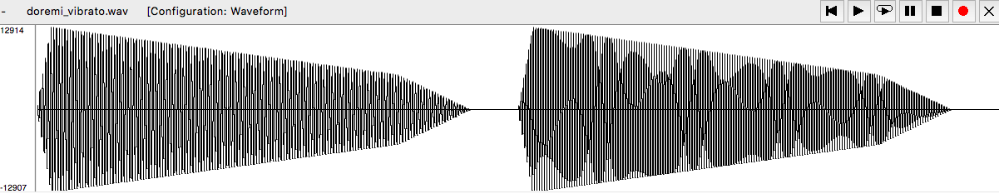
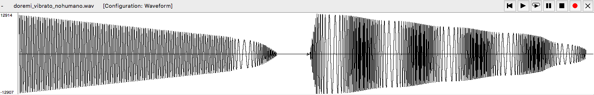

PAV - P5: síntesis musical polifónica
=====================================

Obtenga su copia del repositorio de la práctica accediendo a [Práctica 5](https://github.com/albino-pav/P5) y
pulsando sobre el botón `Fork` situado en la esquina superior derecha. A continuación, siga las instrucciones de la
[Práctica 3](https://github.com/albino-pav/P3) para crear una rama con el apellido de los integrantes del grupo de
prácticas, dar de alta al resto de integrantes como colaboradores del proyecto y crear la copias locales del
repositorio.

Como entrega deberá realizar un *pull request* con el contenido de su copia del repositorio. Recuerde que los
ficheros entregados deberán estar en condiciones de ser ejecutados con sólo ejecutar:

~~~~~~~~~~~~~~~~~~~~~~~~~~~~~~~~~~~~~~~~~~~~~~~~~~~~~.sh
  make release
~~~~~~~~~~~~~~~~~~~~~~~~~~~~~~~~~~~~~~~~~~~~~~~~~~~~~

A modo de memoria de la práctica, complete, en este mismo documento y usando el formato *markdown*, los ejercicios
indicados.

Ejercicios.
-----------

### Envolvente ADSR.

Tomando como modelo un instrumento sencillo (puede usar el InstrumentDumb), genere cuatro instrumentos que permitan
visualizar el funcionamiento de la curva ADSR.

* Un instrumento con una envolvente ADSR genérica, para el que se aprecie con claridad cada uno de sus parámetros:
  ataque (A), caída (D), mantenimiento (S) y liberación (R).
  - La envolvente ADSR genérica que hemos generado es tal que todos los parámetros son iguales a 0.1. Con la siguiente gráfica se puede ver con claridad cada uno de los estados de la curva:
  	* A:	De 0 al primer periodo la curva crece.
	* D:	De A al segundo periodo la curva decrece hasta llegar a una constante.
	* S:	De B al tercer periodo la curva se mantiene constante.
	* R:	De S al tercer periodo la curva vuelve a decaer hasta 0.
	
	
		


* Un instrumento *percusivo*, como una guitarra o un piano, en el que el sonido tenga un ataque rápido, no haya
  mantenimiemto y el sonido se apague lentamente.
  - Para un instrumento de este tipo, tenemos dos situaciones posibles:
    * El intérprete mantiene la nota *pulsada* hasta su completa extinción.


		
				(A=0.1;D=1;S=0;R=0.01)

    * El intérprete da por finalizada la nota antes de su completa extinción, iniciándose una disminución rápida del
      sonido hasta su finalización.


				
				(A=0.1;D=0.01;S=0;R=0.01)

  - Debera representar en esta memoria **ambos** posibles finales de la nota.
* Un instrumento *plano*, como los de cuerdas frotadas (violines y semejantes) o algunos de viento. En ellos, el
  ataque es relativamente rápido hasta alcanzar el nivel de mantenimiento (sin sobrecarga), y la liberación también
  es bastante rápida.


				
				(A=0.1;D=0.01;S=0;R=0.01)

Para los cuatro casos, deberá incluir una gráfica en la que se visualice claramente la curva ADSR. Deberá añadir la
información necesaria para su correcta interpretación, aunque esa información puede reducirse a colocar etiquetas y
títulos adecuados en la propia gráfica (se valorará positivamente esta alternativa).

### Instrumentos Dumb y Seno.

Implemente el instrumento `Seno` tomando como modelo el `InstrumentDumb`. La señal **deberá** formarse mediante
búsqueda de los valores en una tabla.

- Incluya, a continuación, el código del fichero `seno.cpp` con los métodos de la clase Seno.

```
#include <iostream>
#include <math.h>
#include "seno.h"
#include "keyvalue.h"

#include <stdlib.h>

using namespace upc;
using namespace std;

seno::seno(const std::string &param)
  : adsr(SamplingRate, param) {
  bActive = false;
  x.resize(BSIZE);

  /*
    You can use the class keyvalue to parse "param" and configure your instrument.
    Take a Look at keyvalue.h
  */
  KeyValue kv(param);
  int N;

  if (!kv.to_int("N",N))
    N = 40; //default value

  //Create a tbl with one period of a sinusoidal wave
  tbl.resize(N);
  phase = 0, step = 2 * M_PI /(float) N;
  index = 0;
  for (int i=0; i < N ; ++i) {
    tbl[i] = sin(phase);
    phase += step;
  }
}


void seno::command(long cmd, long note, long vel) {
  if (cmd == 9) {		//'Key' pressed: attack begins
    bActive = true;
    adsr.start();
    index = 0;
	  A = vel / 127.;
    float F0 = (440.00*pow(2,((float)note-69.00)/12.00))/SamplingRate;
    step = tbl.size()*F0;
  }

  else if (cmd == 8) {	//'Key' released: sustain ends, release begins
    adsr.stop();
  }
  else if (cmd == 0) {	//Sound extinguished without waiting for release to end
    adsr.end();
  }
}


const vector<float> & seno::synthesize() {
  if (not adsr.active()) {
    x.assign(x.size(), 0);
    bActive = false;
    return x;
  }
  else if (not bActive)
    return x;

  for (unsigned int i=0; i<x.size(); ++i) {
    if (round(index*step) == tbl.size()){
      index = 0;
    }
    x[i] = A*tbl[round(index*step)];
    index++;
  }
  adsr(x); //apply envelope to x and update internal status of ADSR

  return x;
}
```

- Explique qué método se ha seguido para asignar un valor a la señal a partir de los contenidos en la tabla, e incluya
  una gráfica en la que se vean claramente (use pelotitas en lugar de líneas) los valores de la tabla y los de la
  señal generada.
  * En la tabla se guarda un periodo de un seno con N muestras. En el momento de usar la tabla, lo que decidiremos es la velocidad con la que cogemos estas muestras, con el objetivo de recorrer el seno de la tabla más rápido, con lo que generaremos frecuencias más altas, o más lento, para frecuencias más graves.
  Para hacer un ejemplo que sea claro y simple, vamos a suponer que la tabla se ha registrado con solo 8 valores: (0,0.5,1,0.5,0,-0.5,-1,-0.5).
  
  
  
  
  
  * La primera gráfica muestra un periodo básico y las siguientes tienen el doble de muestras que la primera.
  * Para el primer caso, la tabla se recorre con un `step = 2`, por lo que el seno va más rápido y la frecuencia es más alta
  * Para la segunda gráfica, el step es más pequeño, `step = 1`, por lo que se recorre la tabla punto a punto y la frecuencia es más lenta.

  
- Si ha implementado la síntesis por tabla almacenada en fichero externo, incluya a continuación el código del método
  `command()`.

### Efectos sonoros.

- Incluya dos gráficas en las que se vean, claramente, el efecto del trémolo y el vibrato sobre una señal sinusoidal.
  Deberá explicar detalladamente cómo se manifiestan los parámetros del efecto (frecuencia e índice de modulación) en
  la señal generada (se valorará que la explicación esté contenida en las propias gráficas, sin necesidad de
  *literatura*).


  	* Primero de todo, vemos la imágen de dos notas consecutivas (Do y Re) sin ningún efecto. Esta imagen nos servirá de referencia para comparar con las modificadas con los efectos del trémolo y el vibrato.

  		


 	 * La siguiente señal corresponde a las mismas dos notas anteriores, pero la segunda ha sido alterada con un trémolo. Como vemos, este efecto introduce una variación en la amplitud del Re, independientemente del ataque y la caída.

  		


 	 * En las siguientes imágenes la segunda nota ha sido modificada con un vibrato. La primera imagen corresponde a un vibrato natural, pero como no se apreciaban los efectos en la señal, hemos generado un segundo vibrato que exagerase este efecto.

 	 	

 	 * Aquí vemos como el vibrato oscila longitudinalmente, comprimiendo y estirando la frecuencia. Esto se puede interpretar como subidas y bajadas de tono dentro de una misma nota, lo cual no tendría mucho sentido si se hiciese, como en esta segunda imagen, de manera muy marcada, pero si se hace en oscilaciones breves y rápidas la alteración es mínima y se genera un efecto agradable al oído.

  		


- Si ha generado algún efecto por su cuenta, explique en qué consiste, cómo lo ha implementado y qué resultado ha
  producido. Incluya, en el directorio `work/ejemplos`, los ficheros necesarios para apreciar el efecto, e indique,
  a continuación, la orden necesaria para generar los ficheros de audio usando el programa `synth`.

### Síntesis FM.

Construya un instrumento basado en síntesis FM, siguiendo las explicaciones contenidas en el enunciado y el artículo
de [John M. Chowning](https://ccrma.stanford.edu/sites/default/files/user/jc/fm_synthesispaper-2.pdf). El instrumento
usará como parámetros **básicos** los números `N1` y `N2`, y el índice de modulación `I`, que deberá venir expresado
en semitonos.

- Use el instrumento para generar un vibrato de *parámetros razonables* e incluya una gráfica en la que se vea,
  claramente, la correspondencia entre los valores `N1`, `N2` e `I` con la señal obtenida.
- Use el instrumento para generar un sonido tipo clarinete y otro tipo campana. Tome los parámetros del sonido (N1,
  N2 e I) y de la envolvente ADSR del citado artículo. Con estos sonidos, genere sendas escalas diatónicas (fichero
  `doremi.sco`) y ponga el resultado en los ficheros `work/doremi/clarinete.wav` y `work/doremi/campana.work`.
  * También puede colgar en el directorio work/doremi otras escalas usando sonidos *interesantes*. Por ejemplo,
    violines, pianos, percusiones, espadas láser de la [Guerra de las Galaxias](https://www.starwars.com/), etc.

### Orquestación usando el programa synth.

Use el programa `synth` para generar canciones a partir de su partitura MIDI. Como mínimo, deberá incluir la
*orquestación* de la canción *You've got a friend in me* (fichero `ToyStory_A_Friend_in_me.sco`) del genial
[Randy Newman](https://open.spotify.com/artist/3HQyFCFFfJO3KKBlUfZsyW/about).

- En este (lamentable) arreglo, la pista 1 corresponde al instrumento solista (puede ser un piano, flautas, violines,
  etc.), y la 2 al bajo (bajo eléctrico, contrabajo, tuba, etc.).
- Coloque el resultado, junto con los ficheros necesarios para generarlo, en el directorio `work/music`.
- Indique, a continuación, la orden necesaria para generar la señal (suponiendo que todos los archivos necesarios
  están en direcotorio indicado).

También puede orquestar otros temas más complejos, como la banda sonora de *Hawaii5-0* o el villacinco de John
Lennon *Happy Xmas (War Is Over)* (fichero `The_Christmas_Song_Lennon.sco`), o cualquier otra canción de su agrado
o composición. Se valorará la riqueza instrumental, su modelado y el resultado final.
- Coloque los ficheros generados, junto a sus ficheros `score`, `instruments` y `effects`, en el directorio
  `work/music`.
- Indique, a continuación, la orden necesaria para generar cada una de las señales usando los distintos ficheros.
